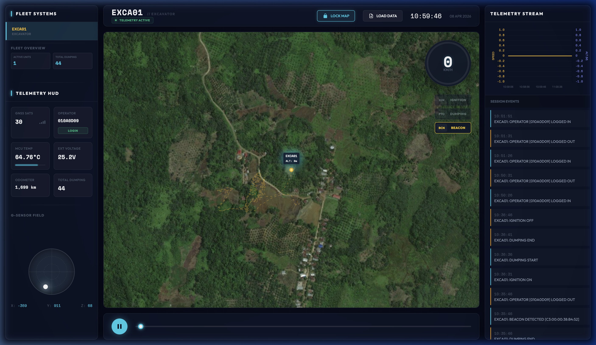

# Preview GPS Tambang - Mission Control

Dashboard pemantauan armada berbasis web berkinerja tinggi yang dirancang khusus untuk operasional pertambangan. Sistem ini menyediakan antarmuka bergaya **"Mission Control"** untuk melacak pergerakan dan status teknis beberapa Dump Truck (DT) serta Ekskavator (EXCA) secara bersamaan dengan visualisasi telemetri yang presisi dan real-time.

---

## 🚀 Fitur Utama

- **Kecerdasan Armada (Fleet Intelligence)**:
  - **Fleet Overview HUD**: Statistik real-time untuk jumlah unit aktif dan akumulasi siklus *dumping* di seluruh armada.
  - **Interactive Event Logs (Time Travel)**: Klik pada log kejadian untuk menyinkronkan dashboard dan fokus peta secara otomatis ke waktu kejadian tersebut.
  - **UTC Temporal Alignment**: Memaksa rendering waktu dalam format UTC untuk akurasi data 100% di semua modul.
- **Visualisasi Lanjutan**:
  - **G-Sensor G-Ball**: Indikator "bubble level" presisi tinggi untuk visualisasi gaya G lateral (X) dan longitudinal (Y).
  - **Sliding Telemetry Stream**: Monitor data dinamis dengan jendela pantau yang bergerak mengikuti waktu misi, menampilkan **Kecepatan** dan **Ketinggian** sekaligus (Dual-Axis).
  - **Speedometer Dinamis**: Indikator kecepatan hingga 40 km/jam dengan transisi warna high-visibility (Aman/Peringatan/Kritis).
- **Kontrol Peta & Fokus**:
  - **Mode Lock Map**: Mengikuti kendaraan aktif secara otomatis sehingga tetap berada di tengah layar.
  - **Marker Interaktif**: Penanda peta berwarna dengan label Unit ID dan Ketinggian (Altitude) permanen.
- **Analisis Operasional**: Perhitungan otomatis siklus "Dumping" berdasarkan status PTO kendaraan.

## 📸 Tampilan Dashboard



## 📊 Format Data (JSONL)

Sistem memproses file JSON per baris (JSONL). Setiap baris mewakili satu denyut telemetri dari sebuah unit.

### Contoh Log
```json
{
  "source": "DT01",
  "timestamp": "2026-04-08T10:35:46Z",
  "latitude": -0.738727,
  "longitude": 117.131224,
  "altitude": 52,
  "speed": 15,
  "mcu_temp": 58.7,
  "external": 25219,
  "ignition": 1,
  "input_status": "100000",
  "ibutton": { "id": "010A0D09", "status": "login", "auth": true },
  "gsensor": { "x": 8, "y": 4, "z": 991 }
}
```

## 🛠️ Cara Penggunaan

1.  **Buka `index.html`** di browser modern pilihan Anda.
2.  Klik tombol **"LOAD DATA"** atau **"SELECT FILES"** di navigasi atas.
3.  Pilih satu atau lebih file `.jsonl` dari penyimpanan lokal Anda.
4.  Gunakan **Fleet Sidebar** di sebelah kiri untuk berpindah fokus antar kendaraan.
5.  Gunakan kontrol **Play/Pause** dan slider **Timeline** di bagian bawah untuk memutar ulang perjalanan misi.

---
*Dibuat menggunakan Leaflet.js, Chart.js, dan Vanilla Modern CSS/JS.*
